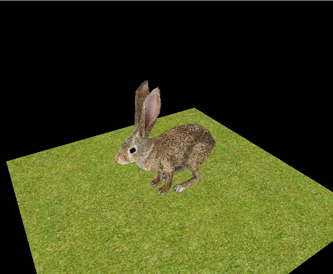
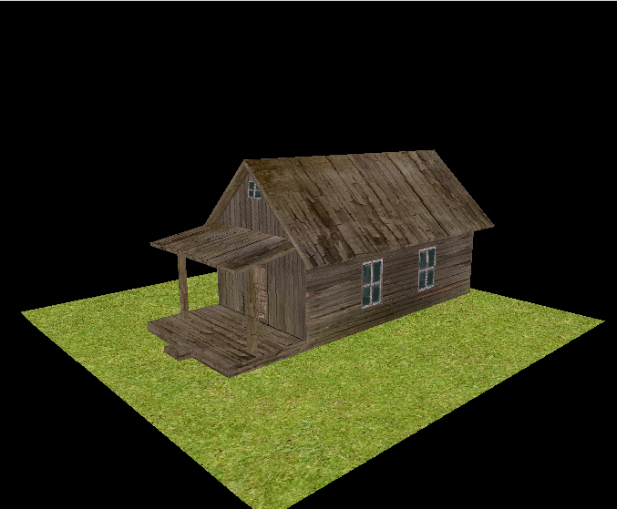
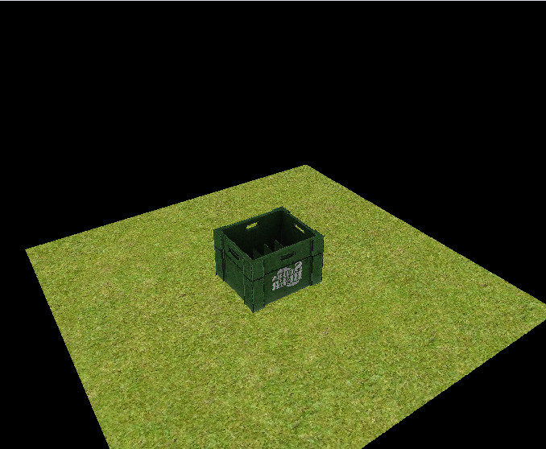

# Simple 3D Engine
Purpose of this project was to learn how 3D rendering works on fundamental level.
This is a software renderer which handles basic tasks that graphic APIs like OpenGL
and DirectX does.

Since this was solely educational project, code is little messy at the moment.
When I have time I'll refactor it. This project is also very mathematical so I recommend
to learn 3D graphic basics before trying to understand the code.

## How it works(very shortly)
-Grabs data from obj file(3D model)
-Constructs vectors from that data
-Manipulates vectors with transformation matrices
-Fill triangles with texture data
-Draw framebuffer to screen

## Features
-Draws 3D objects
-Basic operation on 3d objects: scale, rotate, move
-Can draw multiple objects
-Movable camera
-Supports OBJ file format
-Supports textures

- Working on shadows/lightning

## Screenshots

